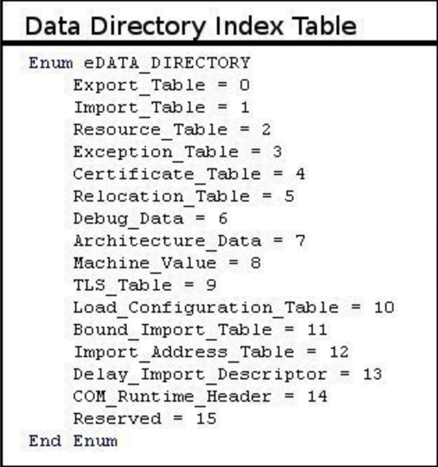
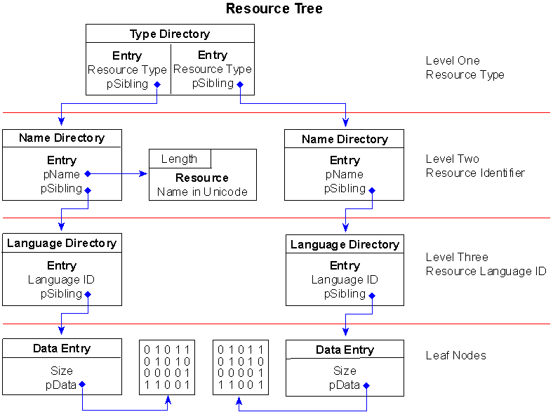

# peresources
A simple go script to parse pe resources.
# PE Resources Section

I had a task in work that required parsing resource section in **pe** files, among many ***non-documented shitty***  things you meet in microsoft, this was one of the hardest ones I had to deal with, not only because they were not documented, but because most of the articles I found either missed some details or even worse, got it wrong. That's why I decided to write this article to make it easier for whoever is searching.

Note: Most of what's mentioned here is copied from other articles, and I will put references in the end.

In this writeup I will assume you are trying to parse a pe file via whatever programming language you are using which is capable of reading data into a structure.

I will be using **Go**.(this would be much easier if it was C on windows as the structures already exist, you only have to cast to them.)

## Finding the root:

The resources takes the form of a tree, where the root is found at the start of the resources data directory. **pe** files have some data directories, which can be found in the **IMAGE_OPTIONAL_HEADER**. To reach the optional header, we have to first get to the PE header location from the **DOS_HEADER**, jump (4+18) bytes which are **Signature** and **COFF File Header**. 

Reading DOS_HEADER:

```go
type IMAGE_DOS_HEADER struct {
	E_magic    uint16
	E_cblp     uint16
	E_cp       uint16
	E_crlc     uint16
	E_cparhdr  uint16
	E_minalloc uint16
	E_maxalloc uint16
	E_ss       uint16
	E_sp       uint16
	E_csum     uint16
	E_ip       uint16
	E_cs       uint16
	E_lfarlc   uint16
	E_ovno     uint16
	E_res      [4]uint16
	E_oemid    uint16
	E_oeminfo  uint16
	E_res2     [10]uint16
	E_lfanew   uint32
}
```

```go
file, err := os.Open(path)
	if err != nil {
		fmt.Errorf("error opening %s file: %v", path, err)
	}
	size, err := file.Seek(0, io.SeekEnd)
	if err != nil {
		fmt.Errorf("error getting size of file %s: %v", path, err)
	}
	file.Seek(0, 0)
	raw := make([]byte, size)
	file.Read(raw)
	r := bytes.NewReader(raw)
	dosHeader := &IMAGE_DOS_HEADER{}
	if err = binary.Read(r, binary.LittleEndian, dosHeader); err != nil {
		fmt.Errorf("error reading dosHeader from file %s: %v", path, err)
	}
```

Seeking to the optional header (pe header + 4 + 18) and reading it:

```go
type OptionalHeader32 struct {
	Magic                   uint16
	MajorLinkerVersion      uint8
	MinorLinkerVersion      uint8
	SizeOfCode              uint32
	SizeOfInitializedData   uint32
	SizeOfUninitializedData uint32
	AddressOfEntryPoint     uint32
	BaseOfCode              uint32
	BaseOfData              uint32
	ImageBase               uint32
	SectionAlignment        uint32
	FileAlignment           uint32
	MajorOSVersion          uint16
	MinorOSVersion          uint16
	MajorImageVersion       uint16
	MinorImageVersion       uint16
	MajorSubsystemVersion   uint16
	MinorSubsystemVersion   uint16
	Win32Version            uint32
	SizeOfImage             uint32
	SizeOfHeaders           uint32
	Checksum                uint32
	Sybsystem               uint16
	DllCharacteristics      uint16
	SizeOfStackReserve      uint32
	SizeOfStackCommit       uint32
	SizeOfHeapReserve       uint32
	SizeOfHeapCommit        uint32
	LoaderFlags             uint32
	NumberOfRvaAndSizes     uint32
	DataDirectories         [16]DataDirectory
}
type DataDirectory struct {
	VirtualAddress uint32
	Size           uint32
}
```

```go
if _, err = r.Seek(int64(dosHeader.E_lfanew)+4+18, io.SeekStart); err != nil {
		fmt.Errorf("error seeking to optionalHeader in file %s: %v", path, err)
	}
optionalHeader:=&OptionalHeader32{}
	if err = binary.Read(r, binary.LittleEndian, optionalHeader); err != nil {
		fmt.Errorf("error reading optionalHeader from file %s: %v", path, err)
	}
```

Datadirectories indicies are known, resources one is the third directory:



We then have to check the value of rva, if it was 0 then it means the file doesn't have any resources:

```go
resourceDataDirectory:=optionalHeader.DataDirectories[2]
	resourcesRootRVA:=resourceDataDirectory.VirtualAddress
	if resourcesRootRVA==0{
		fmt.Printf("%s has no resources\n",path)
	}
	fmt.Printf("Resources Root RVA:%x\n",resourcesRootRVA)
```

## Understanding the structure:

Once we have the the root we have to parse the tree, but to parse it we have to understand how the structure. Resources has 3 structures: ( **_IMAGE_RESOURCE_DIRECTORY , _IMAGE_RESOURCE_DIRECTORY_ENTRY**, **_IMAGE_RESOURCE_DATA_ENTRY**) 

The root  takes the structure of _IMAGE_RESOURCE_DIRECTORY :

```c
typedef struct _IMAGE_RESOURCE_DIRECTORY {
     DWORD   Characteristics;
     DWORD   TimeDateStamp;
     WORD    MajorVersion;
     WORD    MinorVersion;
     WORD    NumberOfNamedEntries;
     WORD    NumberOfIdEntries;
    IMAGE_RESOURCE_DIRECTORY_ENTRY DirectoryEntries[];
 }
```

- `*DWORD Characteristics`Theoretically this field could hold flags for the resource, but appears to always be 0.*
- `*DWORD TimeDateStamp`The time/date stamp describing the creation time of the resource.*
- `*WORD MajorVersion` `*WORD MinorVersion`Theoretically these fields would hold a version number for the resource. These field appears to always be set to 0.
- `*WORD NumberOfNamedEntries`The number of array elements that use names and that follow this structure.*
- `*WORD NumberOfIdEntries`The number of array elements that use integer IDs, and which follow this structure.*
- `*IMAGE_RESOURCE_DIRECTORY_ENTRY DirectoryEntries[]`This field isn't really part of the IMAGE_RESOURCE_DIRECTORY structure. Rather, it's an array of IMAGE_RESOURCE_DIRECTORY_ENTRY structures that immediately follow the IMAGE_RESOURCE_DIRECTORY structure.*

Every **_IMAGE_RESOURCE_DIRECTORY** has **N** entries where **N = NumberOfIdEntries + NumberOfNamedEntries**, the entry structure:

```c
typedef struct _IMAGE_RESOURCE_DIRECTORY_ENTRY {
     DWORD NameOffset
		 DWORD DataOffset
 }
```

You should have noticed that entries might be identified in two ways, either by names or IDs but yet the struct doesn't have such parameters. In fact its better to look at it in that way:

```c
union {
         struct {
             DWORD NameOffset:31;
             DWORD NameIsString:1;
         } DUMMYSTRUCTNAME;
         DWORD   Name;
         WORD    Id;
     } DUMMYUNIONNAME;
```

So to check whether the entry is by name or by id:

```go
isID := _IMAGE_RESOURCE_DIRECTORY_ENTRY.NameOffset&(0x80000000) == 0
```

*Small note: The entries with names comes before the ones with ID in the **DirectoryEntries** array.*

if it was an **ID** you get the value by :

```go
id :=_IMAGE_RESOURCE_DIRECTORY_ENTRY.NameOffset & 0xffff
```

if it was a name then you should get the pointer:

```go
offsetToName:=_IMAGE_RESOURCE_DIRECTORY_ENTRY.NameOffset &^ (0x80000000)
// (&^) is equivalent to (& ~) in C, x&^y means x and (BITWISE not y)
```

seek there and the read the following struct:

```go
typedef struct _IMAGE_RESOURCE_DIR_STRING_U
   {
     WORD Length;
     WCHAR NameString[1]; //The name string has **length** wchars.
	 }
```

NOTE: It should be noted that the address here is relative to the root node not the image base, I can't stress this enough, your code will be fine and you will get mad.

Now you have read the identifier for the entry, you should get check the **OffsetToData**. An entry may point to two different structures: **_IMAGE_RESOURCE_DIRECTORY**; which has been already explained, or **_IMAGE_RESOURCE_DATA_ENTRY**. 

But how do we know? you guessed it, just like the name:

```c
union {
         DWORD   OffsetToData;
         struct {
             DWORD   OffsetToDirectory:31;
             DWORD   DataIsDirectory:1;
         } DUMMYSTRUCTNAME2;
     } DUMMYUNIONNAME2; 
```

```go
isDirectory:=_IMAGE_RESOURCE_DIRECTORY_ENTRY.OffsetToData&(0x80000000) > 0
address := rdeRaw.OffsetToData &^ (0x80000000)
```

Again, the address is relative to the root node address, not the image base.

You seek to the address, if it was a directory you repeat the operation from the beginning, if it is not, then its a **_IMAGE_RESOURCE_DATA_ENTRY**:

```c
typedef struct _IMAGE_RESOURCE_DATA_ENTRY {
    ULONG   OffsetToData;
    ULONG   Size;
    ULONG   CodePage;
    ULONG   Reserved;
}
```

- *`ULONG OffsetToData` The address of a unit of resource data in the Resource Data area. **This address is not relative to the root, its relative to the image-base**.*
- `ULONG Size` *The size, in bytes, of the resource data that is pointed to by the Data RVA field..*
- `ULONG CodePage` The code page that is used to decode code point values within the resource data. Typically, the code page would be the Unicode code page.

This structure holds the address to the main resource data and its size.

We now know main node structures, lets look at the big picture:

## The big picture:

The tree is actually 4 levels, the root is level 0, after you read the root you can find its entries, entries are the children of the root and they point to the next level:

### Level 1: Resource Type

A resource can be one of the following types:

**1: cursor
2: bitmap
3: icon
4: menu
5: dialog box
6: string table entry
7: font directory
8: font
9: accelerator table
10: application defined resource (raw data)
11: message table entry
12: group cursor
14: group icon
16: version information
17: dlginclude
19: plug and play resource
20: VXD
21: animated cursor
22: animated icon
23: HTML
24: side-by-side assembly manifest**

The type will be in the identifier (Name) in the **_IMAGE_RESOURCE_DIRECTORY_ENTRY**, so you get the value and search the above list to know the type. 

### Level 2: Actual Resource

After knowing the type, you now have a  **_IMAGE_RESOURCE_DIRECTORY**, inside that directory you will have the entries for the resources, each entry is identified by either a name or an id that you use in windows apis to access the resource. 

### Level 3: Languages

The entry we just got although points to a directory, this is the last directory you will have to traverse to, this last directory is the **Language Directory**, a resource may exist in more than one language which gives flexibility to programmer. So after reading the entries from that directory, you should use every entry's identifier to know what language is that.

LanguageID is actually two parts; primary part and secondary part, read about it [here](https://docs.microsoft.com/en-us/windows/win32/intl/language-identifier-constants-and-strings). The primary language id  is the low byte of low word and sublanguage is the high byte. So 0x0301 means:

`Primarylanguage=0x01, Sublanguage=0x03`, which if we looked at the given link will know its **Egypt's Arabic**.

Now you should have the following shape in your mind:



This is not the end of the article. In the future, I will add further details regarding how windows deals with resources and how are the APIs like (LoadResource,LoadString) are implemented.

## References:

[http://kp-angel.blogspot.com/2014/07/tutorial-portable-executable-format-and.html](http://kp-angel.blogspot.com/2014/07/tutorial-portable-executable-format-and.html)

[https://blog.kowalczyk.info/articles/pefileformat.html](https://blog.kowalczyk.info/articles/pefileformat.html)

[https://blackholesunsite.wordpress.com/2014/11/10/resource-mess/](https://blackholesunsite.wordpress.com/2014/11/10/resource-mess/)

## Reactos:

  [https://doxygen.reactos.org/](https://doxygen.reactos.org/) 
      

ReactOs can be seen as an open source Windows 2003, it has been my go to since I started implementing some windows apis, it saved a lot of time for me because without it I would have spent a lot of time reversing windows apis. I hope I can one day contribute in it.
